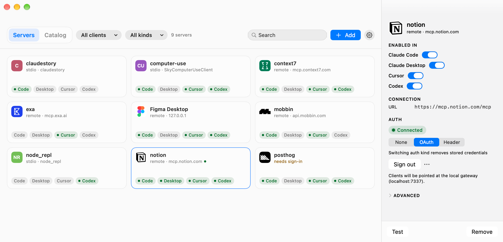
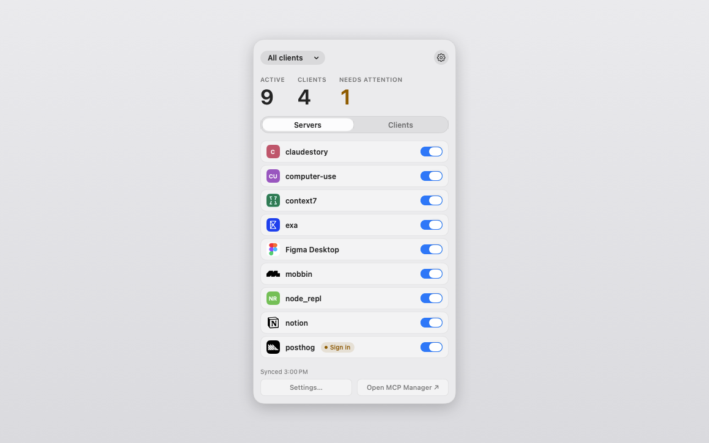

# MCP Manager

**[mcpmanager.space](https://mcpmanager.space)**

You add an MCP server to Claude Code, then add it again in Cursor, then again in Claude Desktop,
and by the third time the details have drifted. MCP Manager keeps one library of servers and syncs
it into the config files those clients already read (Claude Code `~/.claude.json`, Claude Desktop,
Cursor `~/.cursor/mcp.json`, Codex `~/.codex/config.toml`), with a checkbox per client so a server
can be on in one place and off in another. Remote servers that need OAuth are signed into once
through a local auth gateway, and every client talks to the gateway instead of holding its own
token. There is a Catalog tab for finding a server in the first place: a curated list that ships
with the app, plus a live search of the official MCP registry. And any server can be tested from
the app before you trust it.

macOS only, and it needs macOS 26 or later.

## Screenshots





## Install

```
brew install --cask 31carlton7/tap/mcp-manager
```

### Build from source

Needs Xcode 26 and `brew install xcodegen`.

```
git clone https://github.com/31Carlton7/mcp-manager.git
cd mcp-manager/Apps/MCPManager
xcodegen generate
xcodebuild -project MCPManager.xcodeproj -scheme MCPManager -configuration Debug \
  -derivedDataPath build build
open build/Build/Products/Debug/MCPManager.app
```

`xcodegen generate` writes the `.xcodeproj`, which is not checked in. After that you can open the
project in Xcode instead of using `xcodebuild`. The build embeds the daemon in the app bundle, so
there is nothing else to install.

## How it works

The app is a menu bar item and a window; it does no file writing of its own. A daemon called
`mcpmd` does the work. It ships inside the app bundle and runs as a LaunchAgent
(`co.charmtechnologies.mcpmd`), registered with `SMAppService` the first time you launch the app,
which means an upgrade swaps the bundle and the next start runs the new binary.

The daemon owns `~/.mcpm/servers.json`, the library and the only source of truth. It watches each
client's config file, imports anything you added by hand, and writes those files back with only
the MCP section touched. Everything else in the file stays byte-for-byte identical, and a copy goes
to `~/.mcpm/backups/<client>/` before every write. The app talks to the daemon over
`~/.mcpm/mcpmd.sock`, mode 0600.

Nothing is written until you say so. On first launch the app shows what it found across your
clients and what the first import would change, and the daemon stays read-only (reading and
planning, writing nothing) until you confirm it.

Preferences live in `~/.mcpm/settings.json`: `gatewayPort` (7337 by default), `backupRetention`
(5 backups per client) and `importConfirmed`, the flag the onboarding sets. Settings in the app
write the same file. `MCPM_GATEWAY_PORT` outranks the file when it is set.

Servers with `auth: oauth` or `auth: header` are written to clients as
`http://localhost:7337/s/<id>/mcp` instead of their real URL. The gateway on that port proxies the
request upstream and attaches the credential, refreshing an expiring OAuth token before it goes
out. Tokens live in the Keychain, never in `servers.json` and never in a client's config.

### Conflict rule

Library wins on shape, client wins on presence. The command, args, env, URL and headers all come
from the library, but whether a server appears in a given client's file is whatever that file last
said. Editing a server in the app changes it everywhere it is enabled; adding or removing one by
hand in a client's own config flips that client's checkbox instead of being reverted.

### Claude Code rewrites its config from memory

A running Claude Code session holds `~/.claude.json` in memory and rewrites the whole file when it
saves. If mcpm edits that file while a session is open, the session's next write can put its own
version back. Because presence belongs to the client, mcpm reads that as you removing the server
from Claude Code and turns the checkbox off. Restart Claude Code, or make the change with no
session running, and re-enable it.

## Security

- The gateway binds 127.0.0.1 only, and rejects any request whose `Host` is not localhost, which
  keeps a browser on the machine from reaching it by DNS rebinding.
- Any `Authorization` header a client sends is stripped before the request is forwarded. The only
  credential that goes upstream is the one the daemon holds.
- Request and response bodies are never logged.
- OAuth tokens and header secrets are stored in the Keychain, accessible after first unlock, not
  synced to iCloud. The library file and the client configs never contain them.
- OAuth uses PKCE S256 with a single-use, short-lived `state` and an exact redirect match.
- The control socket is mode 0600, so only your own account can open it.

## Development

```
swift test
```

The daemon and the gateway are plain SwiftPM targets, so most work needs no Xcode at all:

```
swift build && .build/debug/mcpmd
```

Two environment variables make local runs easier. `MCPM_TOKEN_STORE=file` puts tokens in a 0600
file under `~/.mcpm` instead of the Keychain, which matters because every debug rebuild changes the
binary's code identity and macOS prompts for Keychain access again. `MCPM_GATEWAY_PORT` moves the
gateway off 7337 when something else has the port or when two instances are running.

Since the daemon reads and writes real config files, run it against a scratch `HOME` when you are
not sure what it will do:

```
HOME=$(mktemp -d) MCPM_TOKEN_STORE=file MCPM_GATEWAY_PORT=7447 .build/debug/mcpmd
```

Rebuilding the app changes its code signature, and launchd holds the code requirement it recorded
when the login item was registered. So after a dev (ad-hoc signed) build it refuses to spawn the
bundled daemon (`spawn failed`, "needs LWCR update") even though the service still reports as
enabled. Re-registering the login item rewrites the requirement. The app does this itself when the
service is unreachable a few seconds after launch, or you can trigger it from Settings → Repair
registration. Signed release builds keep a stable identity and don't run into this.

## Roadmap

- More clients (Windsurf, Zed, VS Code) once the four in place have settled.

## License

MIT. See [LICENSE](LICENSE).
